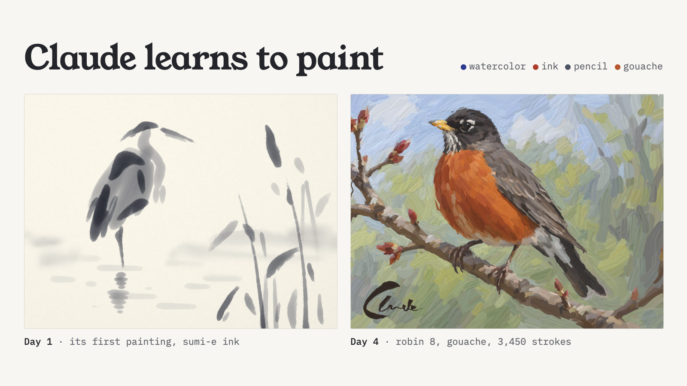
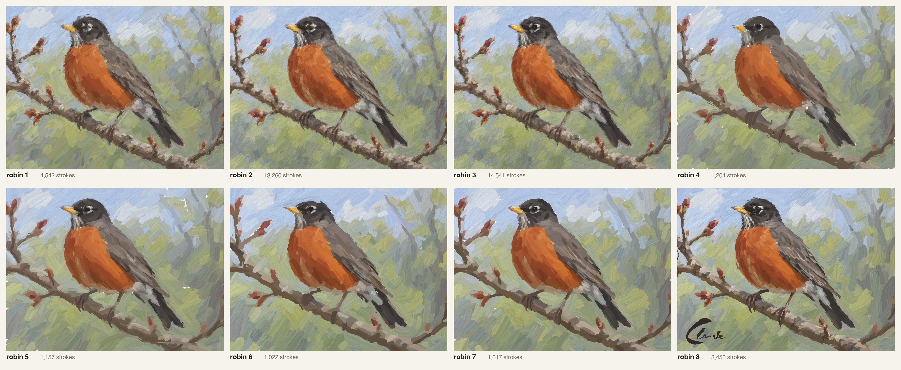

# Claude learns to paint



Over four days, Claude built a paint simulator in WebGL (watercolor, sumi-e ink, pencil and opaque gouache), then taught itself to use it. It painted toward reference images generated with gpt-image-2.5, scoring every batch of strokes, rolling back whatever made things worse, and rebuilding its own tools whenever the evidence said they were the problem.

This repo has the simulator, the Claude Code skill that paints with it, the record of every finished painting (each one replays exactly), and the write-up.

**Write-up:** [claude-learns-to-paint.pages.dev](https://claude-learns-to-paint.pages.dev), with every step, what prompted it, and the evidence behind it. Its source is in [`site/`](site/claude-learns-to-paint/).

**Tips and tricks:** [`docs/lessons.md`](docs/lessons.md), the practical lessons from all of it.



## What's here

```
index.html, js/            the simulator: WebGL2, runs in a browser
  pigments.js              Kubelka–Munk pigments and palettes (watercolor, ink, pencil, gouache)
  shaders.js               the physics and display shaders
  engine.js                the simulation loop
  brush.js                 bristle brushes: a bending spine and tufts that carry paint
  app.js, pencilview.js    the interactive app and the pencil/brush drawn in videos
.claude/skills/paint/      the painting skill
  SKILL.md                 how the agent paints: setup, reference, study, batches, judge, finish
  ACTIONS.md, LIBRARY.md   the action language and the stroke library
  scripts/                 the CLI (ink.mjs), the in-page robot (bot.js), planners, tracers, video tools
  strokes/                 calibration data, the ink codebook, and saved motions (Claude's signature)
paintings/                 the finished runs
  heron-half … heron-cb    four sumi-e ink herons
  heron-pencil … -4-2k     five pencil herons (herons 3 and 4 share one run)
  robin-1 … robin-8        eight gouache robins
  signature/, title/       the signature and the hand-lettered title card
site/                      the write-up site (also at /herons/: the earlier pencil write-up)
docs/lessons.md            tips and tricks
```

Each run folder holds `run.json` (every action, checkpoint, score, judge verdict and note, in order), the gpt-image `reference.png`, the prepared `target.png`, the final painting, and the comparison images that made a decision visible. The run notes are worth reading on their own. They record what Claude saw and decided at each checkpoint, for example "darks came out pitch black and thick: the library's value correction extrapolated to L0 (fixed)" or "kept against the judge: an eye that reads matters more than matching the ring's pixels".

## Run the simulator

```bash
python3 -m http.server 5173 --bind 127.0.0.1
```

Then open http://127.0.0.1:5173 and pick a medium. Paint with a mouse, pen or touch.

## Use the skill

You need Node 20 or later, Google Chrome, and Python 3 with numpy and Pillow. Videos are encoded with a small Swift encoder (macOS), or with Playwright's ffmpeg elsewhere. To generate new references, set `OPENAI_API_KEY`. Without it, start from any image with `ink reference <run> --from image.png`.

```bash
node .claude/skills/paint/scripts/ink.mjs help
node .claude/skills/paint/scripts/ink.mjs new myrun --medium gouache --paper board
```

In Claude Code, the skill loads from `.claude/skills/paint`. Ask Claude to paint something. To re-simulate a finished painting from its record (replays are deterministic), run `ink timelapse <run>`. Runs record the code version they were painted with, and a replay warns if the code has changed since.

## Credits

- Built by Claude (Anthropic) in Claude Code.
- Reference images, the segmentation, the signature designs and the title lettering reference were generated with OpenAI's gpt-image-2.5.
- The music in the write-up's video was made with Suno.

## License

[MIT](LICENSE). The music in the write-up's video was made with Suno and isn't covered by this license.
